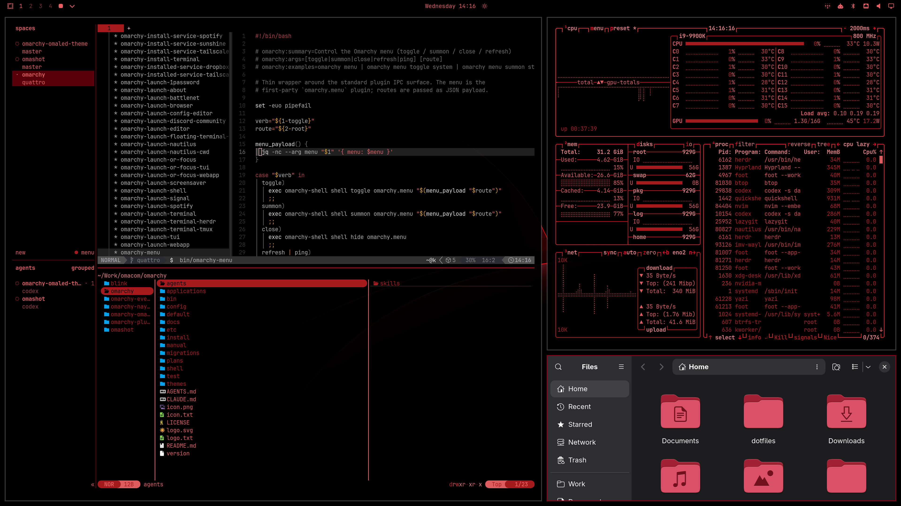
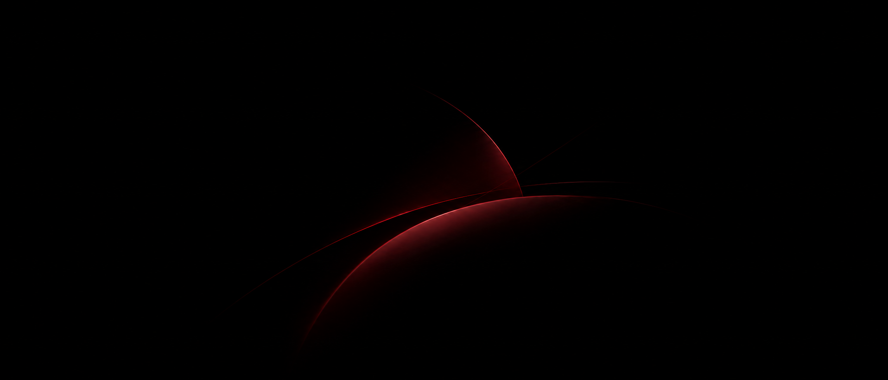

# OmaLED

An Omarchy theme that prevents burn-in on OLED displays.

Because burn-in is normally caused by the display's short-lived blue subpixels, a red and black theme is optimal, even before grayscale.

OLED owners may also be interested in the [OmaLED plugin](https://github.com/brianblakely/omaled).
